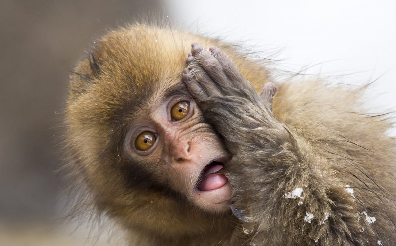

# Your Coding Career Counselor

#### A quiz to help students of code select the programming language that's right for them, March 2021

#### By Jonathan Stull

## Description

This project exists to serve coding students curious about their path into the web development industry. With a wide variety of programming languages available, this website serves to hone&mdash;sort of&mdash;students' understanding of which language they should choose to study when they begin their coding journey.

Of note: This website evaluates students for only the following languages: Ruby, React, and Swift.

See the website on [GitHub Pages](http://jonathanstull.github.io/my-languages).

## Setup/Installation Requirements

Software requirements (internet browser, code editor, etc.)
1. Internet browser
2. A code editor like VSCode or Atom to view or edit the codebase

Download/clone instructions
1. Download this repository onto your computer by clicking the 'code' button
2. Open the project folder.
3. Double-click the index.html to open it in your web browser

Open via Bash/GitBash:
1. Clone this repository onto your computer: git clone {PUT_REPO_HERE}
2. Navigate into the {NAME_OF_DIRECTORY}  directory, and open in VSCode or preferred text editor code .
3. Open index.html in Chrome or preferred browser

## Known Bugs

* None

## Technologies Used

* HTML/CSS
* jQuery
* Visual Studio Code
* Google Chrome

## Credits and Acknowledgements

* Typefaces used: Dela Gothic One (h1), Montserrat Light 300 (body), Comfortaa (footer)
* Typefaces chosen with the help of [Google Fonts](https://fonts.google.com/share?selection.family=Comfortaa:wght@700%7CDela%20Gothic%20One%7CMontserrat:wght@300;700)
* This webpage uses the color scheme [Monkey Business](https://coolors.co/201528-8789c0-f5f9e9-c2c1a5-ef5b5b), generated with the help of Coolors.co
* The header photo belongs to wildlife biologist [Mogens Trolle](https://www.instagram.com/mogenstrolle/). Find the story behind this photo at [caters News Agency](https://www.catersnews.com/stories/animals/huh-photographer-captures-funny-photo-as-muddled-monkey-strikes-a-confused-pose-for-the-camera/)

## MIT License

Copyright (c) 2021 Jonathan Stull

Permission is hereby granted, free of charge, to any person obtaining a copy of this software and associated documentation files (the "Software"), to deal in the Software without restriction, including without limitation the rights to use, copy, modify, merge, publish, distribute, sublicense, and/or sell copies of the Software, and to permit persons to whom the Software is furnished to do so, subject to the following conditions:

The above copyright notice and this permission notice shall be included in all copies or substantial portions of the Software.

THE SOFTWARE IS PROVIDED "AS IS", WITHOUT WARRANTY OF ANY KIND, EXPRESS OR IMPLIED, INCLUDING BUT NOT LIMITED TO THE WARRANTIES OF MERCHANTABILITY, FITNESS FOR A PARTICULAR PURPOSE AND NONINFRINGEMENT. IN NO EVENT SHALL THE AUTHORS OR COPYRIGHT HOLDERS BE LIABLE FOR ANY CLAIM, DAMAGES OR OTHER LIABILITY, WHETHER IN AN ACTION OF CONTRACT, TORT OR OTHERWISE, ARISING FROM,
OUT OF OR IN CONNECTION WITH THE SOFTWARE OR THE USE OR OTHER DEALINGS IN THE SOFTWARE.

## Contact Information

Those interested may reach out to Jonathan Stull via email at <jonathan.d.stull@gmail.com>.